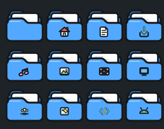

<div align="center">


# Kiwori Icons

[](LICENSE.md)
[]()
[]()
[]()

Pastel cartoon icon theme for Linux. Bold `#171717` outlines.

</div>

---

<div align="center">

## Applications


## Folders



## File Types


## Launchers


</div>

---

## Install

```bash
git clone https://github.com/MakdumIbrohim/kiwori-icons.git
cd kiwori-icons
./scripts/install.sh
```

Activate: **System Settings → Colors & Themes → Icons → Kiwori → Apply**.

---

## Docs

* [Design Guidelines](docs/DESIGN.md)
* [Icon Naming](docs/ICON-NAMING.md)
* [Development](docs/DEVELOPMENT.md)
* [Contributing](docs/CONTRIBUTING.md)

## License

[GPL-3.0](LICENSE.md). Third-party logos belong to their respective owners, used for desktop interoperability under fair use.
