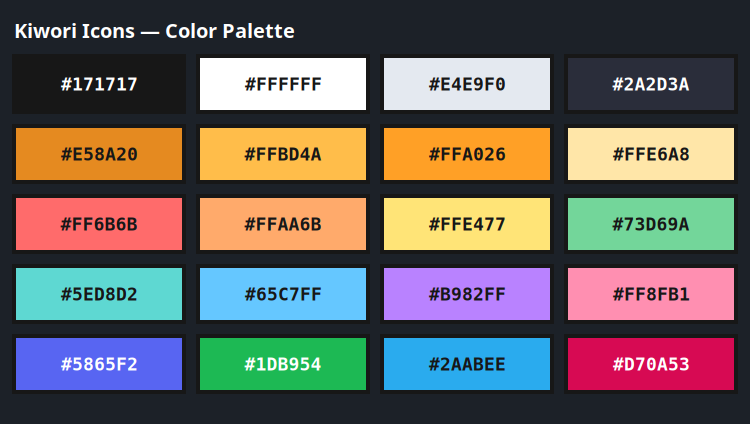

# Kiwori Design System

Design guidelines to maintain visual cohesion and quality across all icons in the **Kiwori** theme.

---

## 1. Core Principles

> **Recognizable, Playful, Colorful, Consistent.**

* **Recognizable**: Every application must preserve its essential brand identity and core motifs (Firefox must look like Firefox, Spotify must look like Spotify).
* **Playful**: Lighthearted, friendly cartoon and sticker-inspired aesthetic.
* **Colorful**: Expressive pastel backgrounds combined with punchy saturated focal accents.
* **Consistent**: Shared shape language, uniform outline weights, aligned corner radii, and balanced visual mass across all categories.

---

## 2. Canvas & Grid Metrics

* **Format**: Pure vector SVG (Scalable Vector Graphics).
* **Master Artboard**: `256 × 256` px.
* **Mandatory ViewBox**: `viewBox="0 0 256 256"`.
* **Safe Zone / Padding**: 16 px border inset (224 × 224 px active drawing area).

---

## 3. Outline System

A thick, bold dark outline is a cornerstone of the Kiwori visual identity.

* **Outline Color**: `#171717` (Kiwori Black).
* **Outer Silhouette Stroke**: `14px` (or `16px` for primary container card borders).
* **Inner Structural Stroke**: `8px` to `12px` for interior division lines.
* **Line Caps**: `stroke-linecap="round"`.
* **Line Joins**: `stroke-linejoin="round"`.
* **Scaling Behavior**: Do not use `vector-effect: non-scaling-stroke`; strokes must scale proportionally with icon dimensions.

---

## 4. Shape Language

Construct icons using friendly, soft geometric primitives:
* Rounded rectangles / squircles (Reference Corner Radius: `54px` – `58px` on a 256px card).
* Circles and rounded ellipses.
* Smooth organic shapes with generous curvature.

**Prohibited**:
* Razor-sharp corners (< 90° without a fillet/radius).
* Hyper-detailed micro elements that vanish or blur at 16–24px.
* Realistic textures or heavy skeuomorphism.

---

## 5. Official Color Palette

To ensure absolute visual consistency across community contributions, all icons must adhere strictly to these exact color hex codes.



### 5.1 Palette Reference Table

| Hex Code | Role | Description & Usage |
|---|---|---|
| `#171717` | **Outline** | Mandatory outline color for ALL outer silhouettes and inner division lines |
| `#FFFFFF` | Base / Highlight | Base sheets, white highlights, crisp glyphs |
| `#E4E9F0` | Neutral Tint | Folded corner shading, light gray accents |
| `#2A2D3A` | Dark Neutral | Dark squircle card background (gradient with `#1E202A`) |
| `#E58A20` | Folder Base | Folder back tab |
| `#FFBD4A` | Folder Gradient | Folder front flap top gradient |
| `#FFA026` | Folder Gradient | Folder front flap bottom gradient |
| `#FFE6A8` | Folder Highlight | Folder front flap highlight line |
| `#FF6B6B` | Pastel Red | Delete actions, PDF badge, play button, error states |
| `#FFAA6B` | Pastel Orange | Archive/ZIP, HTML brackets, warm UI accents |
| `#FFE477` | Pastel Yellow | JSON `{ }`, JavaScript `JS`, active cursor `_`, warning states |
| `#73D69A` | Pastel Green | Photo frames, sound waves, success states |
| `#5ED8D2` | Pastel Cyan | Code `< / >`, terminal chevrons, network indicators |
| `#65C7FF` | Pastel Blue | System tools, CSS badge, browser accents |
| `#B982FF` | Pastel Purple | Creative tools, developer utilities |
| `#FF8FB1` | Pastel Pink | Audio notes `♫`, multimedia accents |
| `#5865F2` | Vivid Blurple | Primary blue-violet solid/gradient fill |
| `#1DB954` | Vivid Green | Primary vibrant green solid/gradient fill |
| `#2AABEE` | Vivid Cyan-Blue | Primary vibrant cyan-blue solid/gradient fill |
| `#D70A53` | Deep Crimson | Primary deep crimson-red solid fill |

### 5.2 Gradient Guidelines
- Use linear vertical gradients (`x1="0%" y1="0%" x2="0%" y2="100%"`).
- Gradients must stay subtle (a lighter tint on top to a slightly deeper tone on the bottom). Never use harsh multi-color rainbow ramps.
- Every color region must be enclosed or separated by `#171717` stroke outlines.

---

## 6. Technical SVG Requirements

All SVG source files must be clean, lightweight, and valid:
1. Strip proprietary editor namespaces (e.g. Inkscape/Sodipodi metadata).
2. Embedded raster images (base64 PNG/JPEG) are strictly prohibited.
3. External file references (`href="file://..."`) are strictly prohibited.
4. Minimal SVG root element:
   ```xml
   <svg xmlns="http://www.w3.org/2000/svg" viewBox="0 0 256 256" width="256" height="256">
     <!-- Vector paths and shapes -->
   </svg>
   ```
